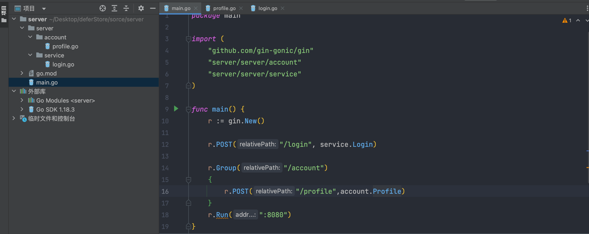

# deferStore

## 1.搭建項目
### 安裝gin框架 
- go get github.com/gin-gonic/gin

### 項目分層
- Service
  - account
    - Router的Group以及底下的方法
    - account(再分層)
      - profile(serviceAccount)
    - order
      - GetOrder
      - List
  - server
    - Router的方法
      - login
      - register
      ...
    


## git推送
1. 移動到根目錄
2. git init 
3. git remote add origin git@github.com:peterouob/deferStore.git
4. 使用sourceTree進行管理
   1. commit新增
   2. push main bench

## 使用Doker建立mysql環境
編寫docker compose
```yml
version: "3.0"
services:
  database:
    container_name: "deferstore-database-dev"
    image: mysql:latest
    environment:
      MYSQL_Database: "deferstore"
      MYSQL_USER: "peter"
      MYSQL_PASSWORD: "password"
      MYSQL_ROOT_PASSWORD: "password"
    volumes:
      - ./data:/var/lib/mysql #將data服務映射到mysql服務
    ports:
      - "3306:3306"
      - "33060:33060"
    expose:
      - "3306"
      - "33060"
```
#### 有可能發生問題
- port被佔用
  - 解決方法
    1. sudo lsof -i tcp:3306 ->會出現端口pid
    2. sudo kill -9 [pid]
    3. 關閉mysql本幾服務
- 開啟後立即關閉且查看log後如下圖且yml無錯誤
  - 解決方法
    1. 將image,container,volume刪除
    2. 將本地data資料夾刪除
    3. 重新啟動docker compose
    


## 使用Gorm/Gen對資料庫進行操作
- go get gorm.io/driver/mysql
- go get -u gorm.io/gorm
- go get gorm.io/gen

```golang
func main() {
	dsn := "peter:password@tcp(localhost:3306)/deferStore?charset=utf8mb4&parseTime=True&loc=Local"
	db, err := gorm.Open(mysql.Open(dsn))
	if err != nil {
		panic(fmt.Errorf("%s", "connect to database have error"))
	}
	g := gen.NewGenerator(gen.Config{
		OutPath:      "/Users/peter/Desktop/deferStore/source/logic/orm/dal",
		ModelPkgPath: "/Users/peter/Desktop/deferStore/source/logic/orm/model",
		Mode:         gen.WithDefaultQuery | gen.WithoutContext,
	})
	g.UseDB(db)
	g.ApplyBasic(g.GenerateAllTable()...)
	g.Execute()
}
```
- 將會產生對應資料表的方法和結構體，因此結構體需要什麼要先在資料表定義出來

## 使用Viper配置Mysql
- go get github.com/spf13/viper